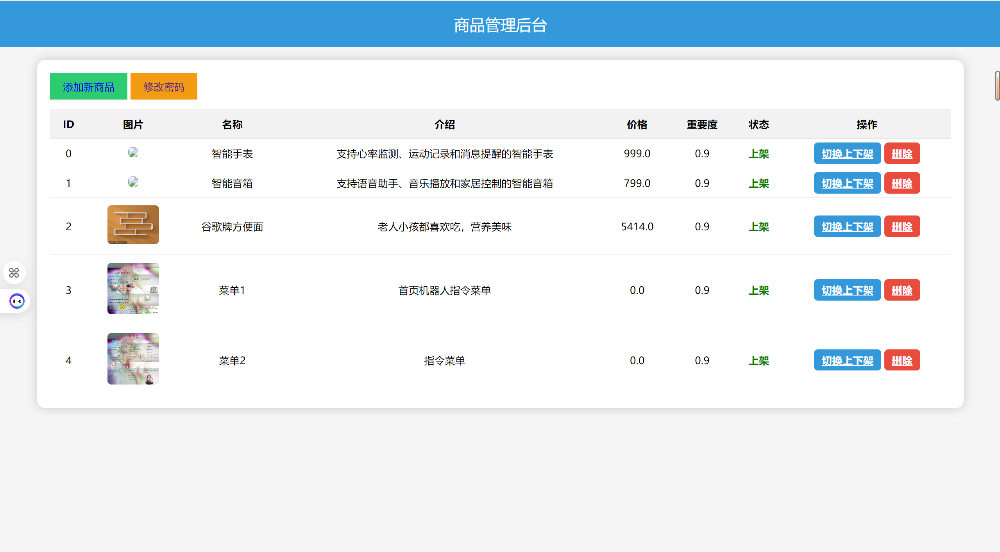
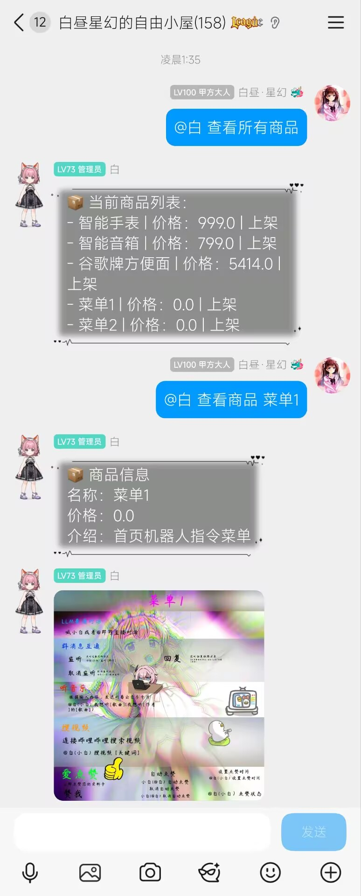

# Product Manager — AstrBot 商品管理插件

<p align="center">
  
  
  
  
</p>

## 📖 项目概述

`product_manager` 是一个基于 [AstrBot](https://github.com/Soulter/AstrBot) 框架的智能商品管理插件，提供 **商品管理 + LLM 商品注入 + WebUI 后台** 三位一体的功能。

### 核心亮点

- 🤖 **LLM 智能注入** — 在对话中自动识别用户提及的商品，通过 System Prompt 注入商品信息，让 AI 自然地推荐商品
- 🎭 **多 Persona 风格** — 支持 10 种对话风格（默认、销售、客服、幽默、高端等），影响 LLM 回复语气
- 🌐 **WebUI 后台** — 基于 Flask 的轻量级管理界面，支持商品增删改查、图片上传、上下架管理
- ⚡ **配置热重载** — 修改配置后即时生效，无需重启插件
- 🔒 **安全设计** — Session 过期、文件上传校验、路径穿越防护

---

## 🗂️ 项目结构

```
product_manager/
├── __init__.py                      # 包入口
├── main.py                          # 插件主入口，注册 Star 类
├── _conf_schema.json                # AstrBot 配置面板 Schema
├── products.json                    # 商品数据文件（JSON 数组）
│
├── catalog/
│   ├── __init__.py
│   └── product_store.py             # 商品存储 CRUD（JSON + 线程安全锁）
│
├── persona/
│   ├── __init__.py
│   ├── persona_store.py             # Persona 管理器（支持热重载）
│   └── persona.txt                  # 多 persona 定义（名称|描述）
│
├── llm/
│   ├── __init__.py
│   ├── matcher.py                   # 商品匹配器（正则匹配 + 重要度排序）
│   ├── injector.py                  # 商品信息注入器（生成 Prompt 字符串）
│   └── prompt_builder.py            # Prompt 构建器（整合 persona + 商品）
│
├── webui/
│   ├── __init__.py
│   ├── server.py                    # Flask Web 后台（登录、CRUD、图片上传）
│   ├── webui_pass.txt               # WebUI 登录密码
│   ├── images/                      # 商品图片目录
│   ├── static/                      # 静态资源（CSS/JS/上传图片）
│   └── templates/                   # Jinja2 模板
│       ├── login.html
│       ├── index.html
│       ├── add_product.html
│       └── change_password.html
│
├── config/
│   └── product_manager_config.json  # 完整配置文件
│
├── data/                            # 数据目录（预留）
│
├── README.md                        # 本文件
├── CHANGELOG.md                     # 更新日志
├── LICENSE                          # 开源协议
├── requirements.txt                 # Python 依赖
└── .gitignore                       # Git 忽略规则
```

---

## 🚀 快速开始

### 前置条件

- Python 3.9+
- AstrBot 框架已部署运行

### 安装

1. 将 `product_manager` 目录放入 AstrBot 的 `plugins/` 插件目录下：

```bash
cd AstrBot\data\plugins
git clone https://github.com/your-username/product_manager.git
```

2. 安装依赖：

```bash
cd product_manager
pip install -r requirements.txt
```

3. 重启 AstrBot，插件自动加载。

### 访问 WebUI

启动后，浏览器访问 `http://127.0.0.1:5465`



- **默认密码**：`moren`
- 首次启动自动生成密码文件 `webui/webui_pass.txt`

---

## 🎯 核心功能

### 1. LLM 商品注入

当用户在对话中提到商品名称或别名时，插件自动识别并匹配商品，将商品信息以 System Prompt 形式注入到 LLM 请求中。

**工作流程：**

```
用户输入 → 商品匹配器（正则匹配名称/别名）
         → 按重要度排序去重
         → 携带 Persona 风格描述
         → 注入 System Prompt → LLM 回复
```

**Persona 风格列表：**

| Persona | 描述 |
|---------|------|
| `default` | 默认风格，简洁明了 |
| `sales` | 销售风格，热情主动 |
| `customer_service` | 客服风格，耐心细致 |
| `cool` | 冷静风格，理性专业 |
| `warm` | 热情风格，活泼亲切 |
| `tech` | 技术风格，详细专业 |
| `friendly` | 友好风格，轻松交流 |
| `funny` | 幽默风格，趣味性 |
| `luxury` | 高端风格，强调品质 |
| `minimal` | 极简风格，简短明快 |

### 2. 商品管理命令

| 命令 | 功能 | 示例 |
|------|------|------|
| `/查看所有商品` | 列出所有商品及上下架状态 | `/查看所有商品` |
| `/查看商品 <名称>` | 查看单个商品详情（含图片） | `/查看商品 智能手表` |

### 3. WebUI 后台管理

- **地址**：`http://127.0.0.1:5465`
- **功能**：
  - 🔑 密码登录（支持修改密码）
  - 📋 商品列表查看（名称、价格、状态）
  - ➕ 添加商品（名称、描述、价格、图片上传）
  - 🔄 上下架切换
  - 🗑️ 删除商品
- **安全特性**：
  - Session 2 小时自动过期
  - 图片上传白名单校验（仅允许 jpg/png/gif/webp/bmp）
  - 路径穿越防护

### 4. 商品数据模型

```json
{
  "id": 0,
  "name": "智能手表",
  "description": "支持心率监测、运动记录和消息提醒的智能手表",
  "price": 999.0,
  "image": "smartwatch.jpg",
  "active": true,
  "allow_auto_inject": true,
  "aliases": ["手表", "智能表"],
  "importance": 0.9,
  "status": "on_shelf"
}
```

| 字段 | 类型 | 说明 |
|------|------|------|
| `id` | int | 商品 ID（自动编号） |
| `name` | string | 商品名称 |
| `description` | string | 商品描述 |
| `price` | float | 商品价格 |
| `image` | string | 图片文件名 |
| `active` | bool | 是否上架 |
| `allow_auto_inject` | bool | 是否允许 LLM 自动注入 |
| `aliases` | string[] | 别名列表（用于匹配） |
| `importance` | float/dict | 重要度权重 |
| `status` | string | `on_shelf` / `off_shelf` |

---



## ⚙️ 配置说明

### AstrBot 配置面板（`_conf_schema.json`）

| 配置项 | 类型 | 默认值 | 说明 |
|--------|------|--------|------|
| `max_match_products` | int | `3` | LLM 注入时最多匹配几个商品 |
| `enable_rotation` | bool | `true` | 是否轮换匹配顺序 |
| `webui_password` | string | `""` | WebUI 登录密码（空则随机生成） |
| `webui_background_image` | string | `"background.jpg"` | WebUI 背景图片 |
| `personas` | list | `[{"name":"默认","style":"中性"}]` | 多 persona 列表 |
| `allow_auto_inject` | bool | `true` | 全局开关：是否允许 LLM 自动提及商品 |

> 💡 **热重载支持**：以上配置修改后即时生效，无需重启插件。

### 完整配置文件（`config/product_manager_config.json`）

```json
{
  "webui": {
    "host": "0.0.0.0",
    "port": 5465,
    "password": "",
    "background_image": "background.jpg",
    "auto_start": true
  },
  "security": {
    "auto_generate_password": true,
    "session_expire_minutes": 120
  },
  "llm_inject": {
    "enable": true,
    "max_similar_products": 3,
    "rotate_strategy": "round_robin",
    "allow_auto_mention": true
  },
  "matching": {
    "enable_name_fuzzy": true,
    "enable_alias_match": true
  },
  "persona": {
    "default_persona": "persona.txt",
    "allow_switch": true
  },
  "storage": {
    "products_file": "products.json",
    "image_upload_dir": "webui/static/uploads",
    "max_image_size_mb": 5
  }
}
```

---

## 🧩 模块职责

| 模块 | 文件 | 职责 |
|------|------|------|
| **主入口** | `main.py` | 注册 AstrBot Star 插件，初始化各模块，监听 LLM 请求和命令 |
| **商品存储** | `catalog/product_store.py` | JSON 文件 CRUD，线程安全锁，支持别名查询、图片路径解析 |
| **Persona** | `persona/persona_store.py` | 解析 `persona.txt`，支持热重载，按名称获取 persona 描述 |
| **商品匹配** | `llm/matcher.py` | 正则匹配用户输入中的商品名/别名，按重要度排序去重 |
| **信息注入** | `llm/injector.py` | 生成商品注入 Prompt 字符串（含 persona），供 LLM 使用 |
| **Prompt 构建** | `llm/prompt_builder.py` | 整合 persona + 商品信息，构建完整 Prompt（独立工具函数） |
| **Web 后台** | `webui/server.py` | Flask 应用，提供商品管理界面，支持图片上传 |

---

## 🔧 技术栈

| 技术 | 用途 |
|------|------|
| [AstrBot](https://github.com/Soulter/AstrBot) | 机器人框架 |
| Python 3.9+ | 开发语言 |
| Flask + Waitress | Web 服务器 |
| Jinja2 | 模板引擎 |
| JSON | 数据存储 |
| threading.Lock | 文件读写并发控制 |
| threading.Thread | WebUI 后台线程 |

---

## 📋 启动流程

```
AstrBot 加载插件
  └─ ProductManager.__init__()
       ├─ 初始化 ProductStore（加载 products.json）
       ├─ 初始化 PersonaStore（加载 persona.txt）
       ├─ 异步启动 WebUI（Flask 后台线程）
       ├─ 注册 LLM 请求监听器（on_llm_request）
       └─ 注册命令处理器（查看所有商品、查看商品）
```

---

## 🤝 贡献指南

1. Fork 本仓库
2. 创建特性分支 (`git checkout -b feature/amazing-feature`)
3. 提交更改 (`git commit -m 'Add amazing feature'`)
4. 推送到分支 (`git push origin feature/amazing-feature`)
5. 提交 Pull Request

---

## 📄 开源协议

本项目基于 MIT 协议开源，详见 [LICENSE](LICENSE) 文件。

---

## 📬 联系方式

- 项目地址：[GitHub](https://github.com/your-username/product_manager)
- 问题反馈：[Issues](https://github.com/your-username/product_manager/issues)